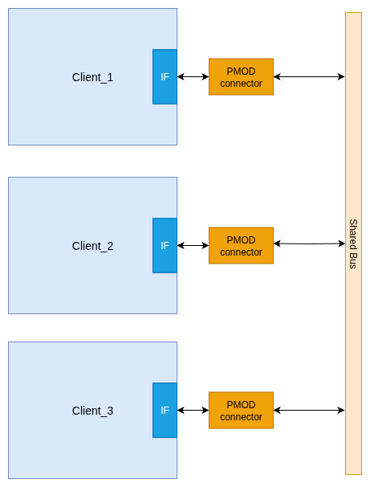
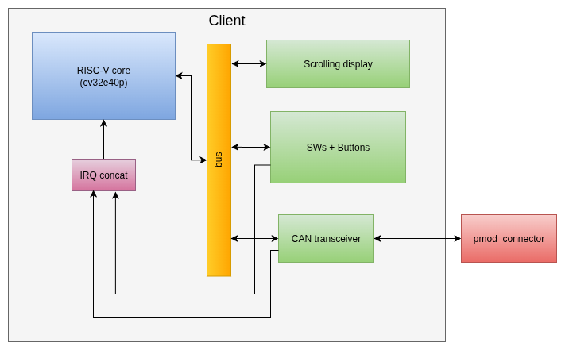
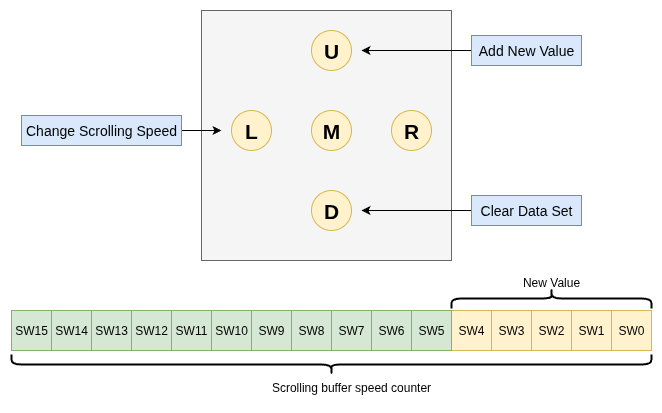

# Distributed System using the CAN Protocol

## RPTU : Embedded Systems Lab : SS 2025

- This is a prototype of a simple distributed system with two clients.
- Communication is handled via the CAN protocol.
- The system can be easily extended to support multiple clients.
- Clients provide the following functionalities:
    - Each client has its own data (ring) buffer:
        - Can add a value
        - Can delete a value
    - All clients' data buffers are synchronized:
        - Adding a value to one client’s buffer will add it to all clients’ buffers.
        - Deleting a value from one client’s buffer will delete it from all clients’ buffers.
    - If a new client is added to the system, its data buffer can be synchronized with the existing clients’ data buffers.
- Each client is implemented on a separate Nexys A7 FPGA board:
    - Data is displayed using the seven-segment display.
    - Switches and buttons are used to:
        - add and delete values in the dataset.
        - Change the display scrolling speed.
    - PmodRS485 connectors are used to connect the client FPGA boards within the distributed system.

## Distributed System Architecture

## Cient Architecture

## Button and switch mapping

## Implementation results

### Demo: Synchronous client update

### Demo: New client initialization

